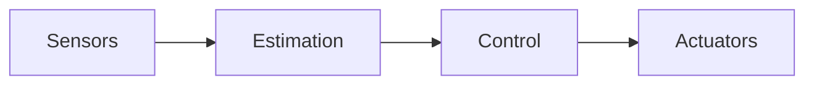

# Architecture

> _TODO_: describe the overall system. 

## Overview

High-level description of the subsystems and how they interact.

## Subsystems

- **Perception / sensing** — TODO
- **State estimation** — TODO
- **Control** — TODO
- **Actuation** — TODO

## Data flow

> _TODO_: packet structure, utilized protocols
