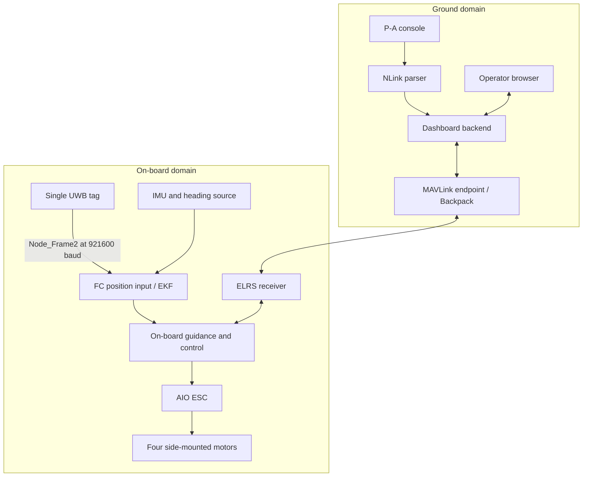
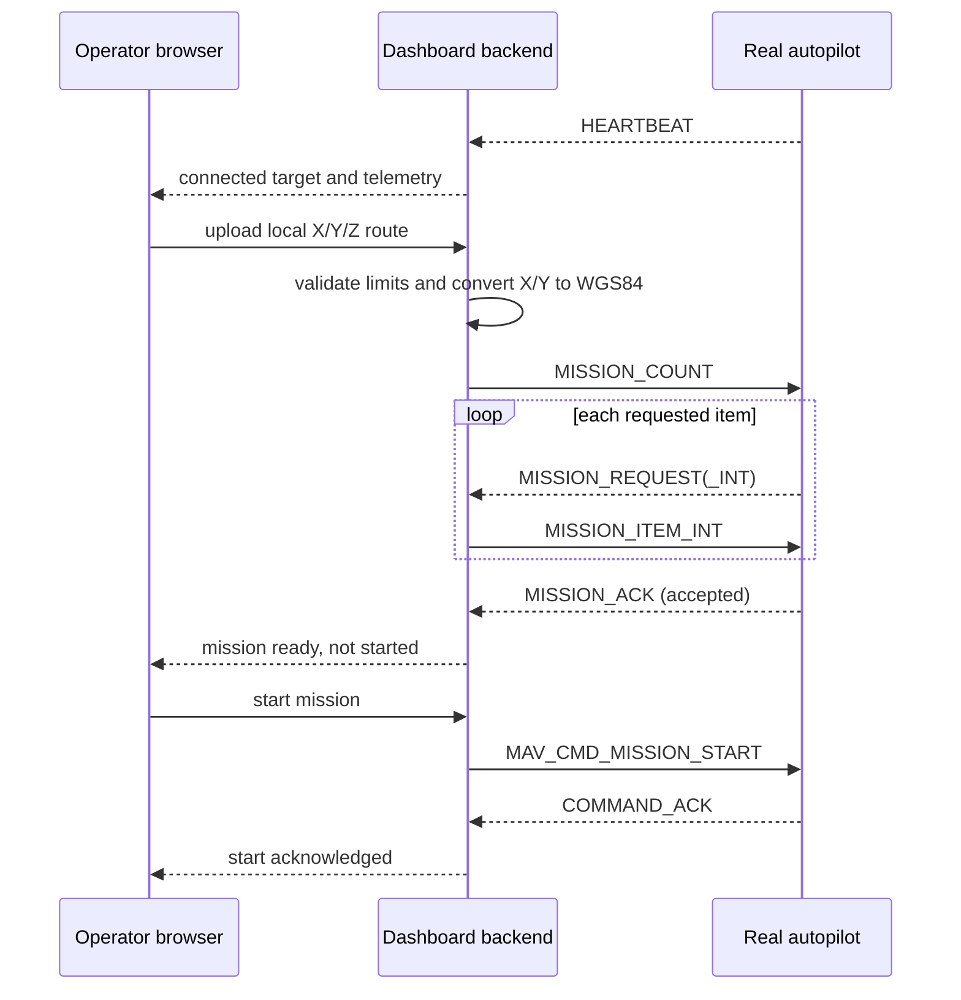

# System architecture

## Design principles

The Stage 1 architecture follows four engineering decisions.

1. **Close the flight loop on board.** The ground station uploads waypoints; it does not continuously stream position targets.
2. **Use one UWB tag in the current baseline.** The mass-constrained flight configuration removed the second tag and ESP32 bridge. Heading must come from the flight controller's inertial and magnetic estimate.
3. **Keep real and replay operation separate.** Replay validates UWB parsing and visualisation only. It does not simulate an airship or certify MAVLink control.
4. **Require protocol-level acceptance.** A command is reported as successful only after the real autopilot returns the expected MAVLink acknowledgement.

## Functional boundary


```mermaid
flowchart TB
  subgraph Vehicle["On-board domain"]
    Tag["Single UWB tag"] -->|"Node_Frame2 at 921600 baud"| EKF["FC position input / EKF"]
    IMU["IMU and heading source"] --> EKF
    EKF --> Control["On-board guidance and control"]
    Control --> ESC["AIO ESC"]
    ESC --> Motors["Four side-mounted motors"]
    Radio["ELRS receiver"] <--> Control
  end

  subgraph Ground["Ground domain"]
    Console["P-A console"] --> Parser["NLink parser"]
    Parser --> Dashboard["Dashboard backend"]
    Browser["Operator browser"] <--> Dashboard
    Dashboard <--> Bridge["MAVLink endpoint / Backpack"]
  end

  Bridge <--> Radio
```

The on-board position path and the ground display path observe the same UWB network but serve different purposes. The flight controller receives the tag directly for control. The P-A console sends network data to the ground parser for monitoring. The dashboard never injects its displayed UWB coordinates as a continuous flight setpoint.

## Data flows

### UWB monitoring path

1. The P-AC anchors and tag perform UWB ranging.
2. The P-A console exposes NLink frames over USB serial.
3. `nlink-dump` uses the upstream Nooploop C/C++ parser through a Python extension.
4. Each decoded frame becomes JSON and is sent as one UDP datagram to port `9999`.
5. The dashboard filters all tag containers to the configured tag ID, then relays the frame to browser clients over `/ws`.
6. The browser plots raw position, an optional exponential moving average, ranges, trail, and experiment recordings.

### Telemetry and command path


```mermaid
sequenceDiagram
  participant UI as Operator browser
  participant API as Dashboard backend
  participant AP as Real autopilot

  AP-->>API: HEARTBEAT
  API-->>UI: connected target and telemetry
  UI->>API: upload local X/Y/Z route
  API->>API: validate limits and convert X/Y to WGS84
  API->>AP: MISSION_COUNT
  loop each requested item
    AP-->>API: MISSION_REQUEST(_INT)
    API->>AP: MISSION_ITEM_INT
  end
  AP-->>API: MISSION_ACK (accepted)
  API-->>UI: mission ready, not started
  UI->>API: start mission
  API->>AP: MAV_CMD_MISSION_START
  AP-->>API: COMMAND_ACK
  API-->>UI: start acknowledged
```

ARM, DISARM, flight-mode, take-off, and mission-start operations use the same rule: the HTTP request alone is not evidence of acceptance. The backend waits for a matching `COMMAND_ACK`, rejects acknowledgements from another system, and reports timeouts and rejections distinctly.

## Coordinate systems

The project uses three related but non-interchangeable frames.

| Frame | Axes and origin | Used by |
|---|---|---|
| UWB hall frame | `X`, `Y`, `Z` in metres from the configured UWB origin | Tag display, anchors, recorded experiments |
| Mission input | `X = north`, `Y = east`, `Z = height above FC Home` | Dashboard route editor |
| MAVLink mission | WGS84 latitude/longitude and relative altitude | `MAV_FRAME_GLOBAL_RELATIVE_ALT_INT` mission items |

The backend converts local north/east offsets around a configured reference latitude and longitude. It deliberately keeps `Z` as a relative altitude; it does not add the configured mean-sea-level origin altitude.

!!! danger "Origin alignment is a flight-safety condition"
    The UWB zero, the flight controller Home, and the configured WGS84 reference must describe the same physical setup. Do not enable automatic origin changes until all three have been measured and checked on the real controller.

## Current and historical localisation paths

### Current target: one tag

The current repository and dashboard are designed for one tag, normally ID `1`. The intended on-board link is:

```text
P-AS tag → UART → ArduPilot Nooploop beacon driver → EKF3
```

The reported baseline parameters are `Node_Frame2`, `921600` baud, `BCN_TYPE=3`, and a serial protocol value of `13`. The exact UART instance and complete controller parameters must be confirmed on the actual MicoAir board.

### Historical experiment: two tags

An ESP32 bridge for a nose and tail tag remains in `firmware/reassembler/`. It computes midpoint position and yaw, rejects stale or implausible baselines, and can emit `VISION_POSITION_ESTIMATE`. The report records this approach as bench-verified, with approximately ±10 cm position noise and about 10° yaw noise. It was removed from the flown configuration to save mass and is not part of the current ground dashboard contract.

## Failure containment

| Failure | Intended behaviour in the current software |
|---|---|
| Malformed UWB datagram | Drop it; do not relay invalid JSON. |
| Frame from another tag | Remove or discard it before WebSocket delivery. |
| MAVLink absent at startup | Keep the web service running and retry connection. |
| Stale heartbeat | Mark the link unavailable, replace the backend connection, and invalidate mission-ready state. |
| Missing or rejected ACK | Return an explicit timeout or rejection; do not claim success. |
| Route outside configured limits | Reject it before sending any mission item. |
| Radio loss after mission upload | The architecture expects the on-board controller to continue, but this behaviour has not yet been flight-validated. |

## Deliberate exclusions

- There is no Software-in-the-Loop vehicle in the production path.
- There is no synthetic blimp position or artificial coordinate offset.
- The ground station does not request telemetry stream rates or silently set a fake origin at connection time.
- The fixed `X-Blimp-Control` header is a cross-site request-forgery barrier, not user authentication.
- The repository does not yet provide a validated four-motor ArduPilot mixer for this airframe.
