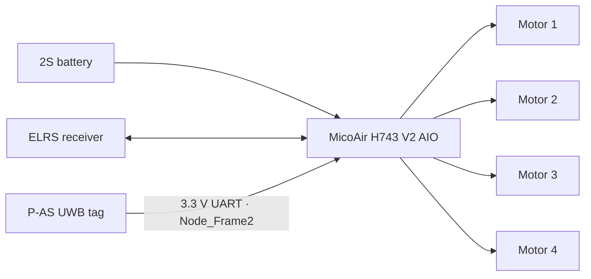

# Hardware

The hardware was selected under a severe lift constraint. The airframe is not a conventional multirotor: buoyancy carries most of the static weight, while four side-mounted propellers provide control authority. Every additional sensor, connector, or printed wall competes directly with the payload margin.

## Prototype bill of materials

The table distinguishes the present one-tag baseline from hardware explored earlier in the project.

| Subsystem | Component | Quantity | Evidence and role |
|---|---|---:|---|
| Flight controller and ESC | MicoAir H743 V2 AIO 35A | 1 | Selected to combine controller and four ESC channels at low mass; intended to support the staged Betaflight-to-ArduPilot path. |
| Motors | HappyModel SE0802, 16000KV | 4 | 2S-class micro brushless motors; connected and tested in the manual-flight configuration. |
| Propellers | Gemfan 1614, three-blade | 4 | Reported as matched to the SE0802 motors. Exact CW/CCW assignment is not yet documented. |
| Battery | 2S pack | 1 | Approximately 26 g in the design report. Capacity, C-rating, connector, and final installed model still require recording. |
| RC link | 2.4 GHz ELRS receiver, EP1/EP2 family | 1 | Manual control and telemetry path. The exact installed receiver revision is unresolved in the report. |
| UWB tag | Nooploop LinkTrack P-AS | 1 current | Current mass-constrained baseline; intended to connect directly to an FC UART. |
| UWB anchors | Nooploop LinkTrack P-AC | 4 configured, up to 5 reported | Four anchors are present in the repository configuration. The report also mentions a fifth available anchor. |
| UWB console | Nooploop LinkTrack P-A | 1 | Collects network frames for the ground station. |
| Operator computer | Raspberry Pi 5 | 1 | Runs the parser and dashboard outside the flight-control loop. |
| Pilot transmitter | RadioMaster TX12 MkII with ELRS | 1 | Manual control; an ELRS Backpack is intended to bridge bidirectional MAVLink. |
| Airframe | Two lighter-than-air envelopes | 1 assembly | Double-envelope direction selected after lift measurements. Exact envelope model and final all-up mass are not recorded. |
| Structure | Custom ePLA-LW gondola and motor mounts | several revisions | V2 used a magnetic lid; V3 reduced the structure to a thin frame, straps, and component slots. |

### Experimental hardware no longer in the baseline

| Component | Purpose | Disposition |
|---|---|---|
| Second P-AS tag | Derive vehicle heading from a nose–tail baseline | Removed before the first flight to recover lift. |
| ESP32 bridge | Read two tags and emit position plus yaw as MAVLink vision data | Bench-verified, then removed with the second tag. The source remains as a historical experiment. |
| Magnetic gondola lid | Protect and retain electronics | Removed during mass reduction. |

## Mechanical platform and lift budget

The project progressed through measurement rather than a fixed initial design.

- A single envelope was reported to leave approximately **68 g** for electronics.
- The team therefore selected a double-envelope configuration.
- The report records **120 g** as the planned double-envelope lift figure.
- After a partially filled envelope admitted air, the assembled system was reported at approximately **70 g** of available lift.
- Removing the lid, ESP32, and second tag made a one-tag manual flight possible.

These values describe different configurations and test conditions; they must not be treated as a single controlled lift curve. Before the next flight, record envelope mass, gross lift, payload mass, temperature, fill age, and final all-up mass in one repeatable test.

## High-level electrical architecture

Only subsystem-level connections are established in the current artefacts. Pad names, wire gauges, connector families, and motor ordering must be taken from a verified as-built schematic rather than inferred here.

!!! warning "Do not derive a wiring harness from this diagram"
    The report does not contain a final pin map, polarity record, motor order, current measurement, or receiver protocol configuration. Verify every connection against the exact MicoAir board revision and produce an as-built schematic before powered integration.

## Interface table

| From | To | Physical interface | Protocol | Function |
|---|---|---|---|---|
| P-AS tag | Flight controller | 3.3 V UART | NLink `Node_Frame2` | On-board position input for the target ArduPilot configuration |
| ELRS receiver | Flight controller | UART | CRSF / ELRS | Pilot commands and radio telemetry |
| Flight controller | Integrated ESC outputs | Board traces / motor pads | Controller-dependent ESC protocol | Four-motor actuation |
| P-A console | Raspberry Pi 5 | USB serial | NLink | Whole-network UWB monitoring |
| Dashboard host | ELRS Backpack | Wi-Fi UDP or USB, to be verified | MAVLink | Mission upload, commands, and telemetry |

The reported baseline for the tag is `Node_Frame2` at `921600` baud. The corresponding flight-controller serial port and parameters are installation-specific; see [Configuration reference](configuration.md).

## UWB deployment

### Anchor geometry

The checked-in `anchors.json` contains four anchors:

| ID | X, m | Y, m | Z, m |
|---:|---:|---:|---:|
| 0 | 0.000 | 0.000 | 1.300 |
| 1 | 0.257 | 2.134 | 1.300 |
| 2 | 5.992 | 2.273 | 1.300 |
| 3 | 5.974 | 0.000 | 1.300 |

This is a recorded software default, not a recommended final geometry. All four anchors are coplanar, whereas the engineering report calls for height separation to improve vertical observability. Measure the actual hall installation and update the file before using range lines or Z values for a test decision.

Recommended deployment principles from the project specification are:

1. cover the operating rectangle rather than clustering anchors;
2. separate at least part of the network vertically;
3. mount the tag below material that may attenuate UWB;
4. preserve a clear antenna field and document tag orientation;
5. define the physical UWB origin and axes with visible floor marks;
6. record every anchor coordinate with the same measurement method.

### Single-tag limitation

One tag provides position but no geometric nose–tail heading. The current architecture therefore relies on the flight controller's heading estimate. The dashboard intentionally displays one active tag and does not fabricate a second point or yaw value.

## Assembly record required before flight

The report supports the broad sequence below, but not yet a reproducible build instruction.

1. Secure the helium cylinder in a tested stand.
2. Characterise each envelope and freeze the mass budget.
3. Print and weigh the selected gondola and four mounts.
4. Build the flight-electronics bench without propellers.
5. Document battery polarity, receiver wiring, UART wiring, and motor numbering.
6. Verify controller power, receiver input, and motor direction while restrained.
7. Install the electronics with strain relief and a known centre of mass.
8. Mount the UWB tag with recorded orientation and unobstructed antenna clearance.
9. Attach propellers only after arm/disarm and failsafe checks pass.
10. Repeat lift, balance, and leak checks on the exact assembled configuration.

Missing manufacturing artefacts are listed on [Current status and roadmap](status.md).

## Known physical hazards

!!! danger "Recorded arming incident"
    During the final project week, the propellers started unexpectedly while arming, pierced an envelope, and caused a helium leak. Treat this as a demonstrated hazard, not a hypothetical one.

- Remove propellers for firmware setup, motor mapping, receiver work, and arming tests.
- Treat a connected flight battery as capable of starting all four motors.
- Keep envelope film, straps, wiring, and hands outside every propeller disc.
- Restrain the propulsion bench and provide a direct way to disconnect power.
- Repair or replace damaged envelopes and leak-test them before filling or flight.
- Use a proper charger and handling procedure for the exact 2S battery once identified.
- Keep replacement envelopes, propellers, connectors, and other failure-prone parts available; lack of spares was a major project lesson.
