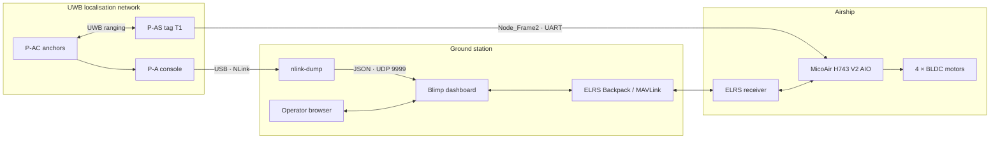

# Blimp: autonomous indoor airship

The Blimp is a Stage 1 proof of concept developed by Innopolis Robotics Society for Innopolis Robotics Lab. It combines a four-motor lighter-than-air platform, Ultra-Wideband (UWB) positioning, a real MAVLink link, and a purpose-built ground dashboard for local route planning.

The project addresses three constraints at once: GPS is unavailable indoors, the lift budget is measured in grams, and the four side-mounted brushless motors do not match an off-the-shelf airship control stack. The resulting system is therefore both a vehicle prototype and an integration platform.

!!! warning "Prototype status"
    This is not a flight-ready product. Manual flight with a one-tag Betaflight configuration was demonstrated. The repository implements the single-tag UWB ground pipeline and a real MAVLink mission transaction, but autonomous UWB-guided flight and the custom onboard ArduPilot configuration still require hardware validation. The last report also records an envelope puncture during an arming incident; repair and a complete propeller-off recommissioning are mandatory before further flight work.

## Stage 1 objective

The intended end state is an indoor waypoint mission whose position-control loop is closed on board:

1. A Nooploop LinkTrack tag supplies local position to the flight controller.
2. The flight controller combines position with its inertial and heading estimate.
3. The ground station displays UWB and MAVLink telemetry and uploads a complete route.
4. The vehicle executes the accepted mission without a continuous ground setpoint stream.

This boundary is deliberate. The Raspberry Pi ground station assists the operator, but it is not part of the stabilisation loop.

## System at a glance

## What is available now

| Area | Current evidence |
|---|---|
| Airframe | Double-envelope platform and lightweight printed gondola iterations were assembled. |
| Propulsion | Four SE0802 motors were connected and exercised; one-tag manual flight was achieved with Betaflight. |
| UWB parsing | Native Nooploop parsers are packaged for Python without ROS and tested against recorded frames. |
| Dashboard | A live 2D hall view, anchor editor, one-tag trace, CSV recording, MAVLink telemetry, and mission editor are implemented. |
| MAVLink | The backend connects to a real endpoint, checks heartbeat freshness, requires protocol acknowledgements, and uploads complete missions. |
| Autonomous flight | Architecture and ground-side support exist; the onboard vehicle configuration and end-to-end flight remain unvalidated. |

## Documentation paths

- Start with [System architecture](architecture.md) to understand the air/ground boundary and data flow.
- Use [Hardware](hardware.md) for the prototype bill of materials, interfaces, and measured constraints.
- Use [Software](software.md) for package responsibilities and implementation details.
- Follow [Installation and launch](getting-started.md) to run the live or replay pipeline.
- Read [Operator procedure](operations.md) and [Test and safety plan](testing.md) before connecting a real vehicle.
- Consult [Configuration reference](configuration.md) and [Dashboard API](api.md) during integration.
